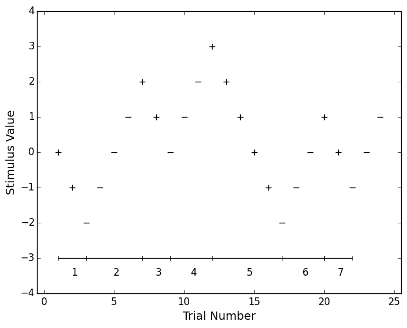

# Up Down Methods
[](https://travis-ci.org/codles/UpDownMethods) 
[](https://coveralls.io/r/codles/UpDownMethods)  
Python module implementing the transformed Up-Down procedure


## Description
Framework for generating psychoacoustic stimuli parameters based on [Levitt 1971](http://www.ncbi.nlm.nih.gov/pubmed/5541744).


## Implementation

### Functions

#### Stimulation

* `initiate_procedure` returns an empty result data frame
* `append_results` appends the last result and returns the next value for stimulation


#### Results and visualisation

* `estimate_reversals` returns an estimate of the value based on last `num` of reversals
* `process_results` calculates procedure values and results
* `midpoints` returns the midpoints for each run
* `runs` returns the start and finish point of each run in results
* `plot_results` plots the procedure results in the same format as the original Levitt paper
* `reversals` return the location and value of reversals


## Example

Recreate figure 5 from Levitt 1971.

```python
# Figure 4 Levitt 1971
resp1 = [CORRECT, CORRECT, INCORRECT, INCORRECT, INCORRECT, INCORRECT,
         CORRECT, CORRECT, INCORRECT, INCORRECT, INCORRECT, CORRECT,
         CORRECT, CORRECT, CORRECT, CORRECT, INCORRECT, INCORRECT,
         INCORRECT, CORRECT, CORRECT, INCORRECT, INCORRECT, INCORRECT]

# Figure 5 Levitt 1971
resp2 = [CORRECT, CORRECT, CORRECT, CORRECT, INCORRECT, CORRECT, INCORRECT,
         INCORRECT, CORRECT, INCORRECT, CORRECT, CORRECT, CORRECT, CORRECT,
         CORRECT, INCORRECT, INCORRECT, INCORRECT, CORRECT, CORRECT,
         CORRECT, CORRECT, CORRECT, CORRECT]

stim1 = ud.UpDownMethod(down=1, up=1, stepSize=1, initialValue=0)
stim2 = ud.UpDownMethod(down=2, up=1, stepSize=1, initialValue=0)

for resp in resp1:
    stim1(resp)

for resp in resp2:
    stim2(resp)

ud.plot_results(stim1.results)
ud.plot_results(stim2.results)
```



