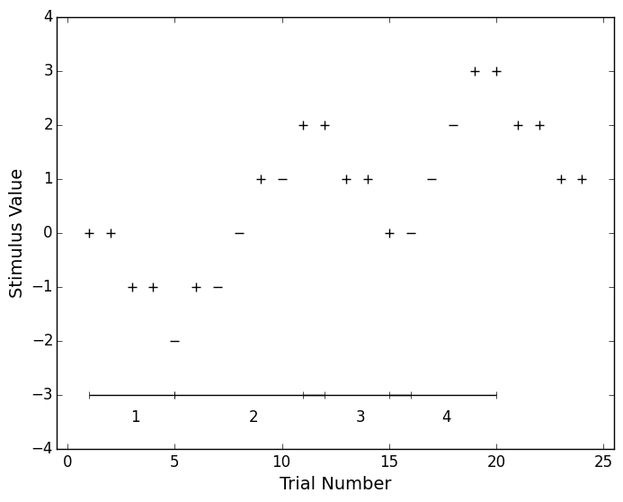

# Up Down Methods
[](https://travis-ci.org/codles/UpDownMethods) 
[](https://coveralls.io/r/codles/UpDownMethods)  
Python module implementing the transformed Up-Down procedure


## Description
Framework for generating psychoacoustic stimuli parameters based on [Levitt 1970](http://www.ncbi.nlm.nih.gov/pubmed/5541744).


## Implementation

### Functions

#### Stimulation

* `initiate_procedure` returns an empty result data frame
* `append_results` appends the last result and returns the next value for stimulation


#### Results and visualisation

* `process_results` calculates procedure values and results
* `midpoints` returns the midpoints for each run
* `runs` returns the start and finish point of each run in results
* `plot_results` plots the procedure results in the same format as the original Levitt paper


## Example

```python

import UpDownMethods as ud

#
# Simulation parameters

responses = [CORRECT, CORRECT, CORRECT, CORRECT, INCORRECT, CORRECT, INCORRECT,
             INCORRECT, CORRECT, INCORRECT, CORRECT, CORRECT, CORRECT, CORRECT,
             CORRECT, INCORRECT, INCORRECT, INCORRECT, CORRECT, CORRECT,
             CORRECT, CORRECT, CORRECT, CORRECT]

initalValue = 0
stepSize = 1
down = 2
up = 1


#
# Experiment

results = ud.initiate_results()

nextValue, self.results = ud.append_result(results, responses[0], down, up, stepSize, initalValue)

for resp in responses[1:]:
    nextValue, results = ud.append_result(results, resp, down, up, stepSize, nextValue)


#
# Process results

ud.plot_results(self.results)
plt.savefig(‘test.png’, bbox_inches=‘tight’)
```


